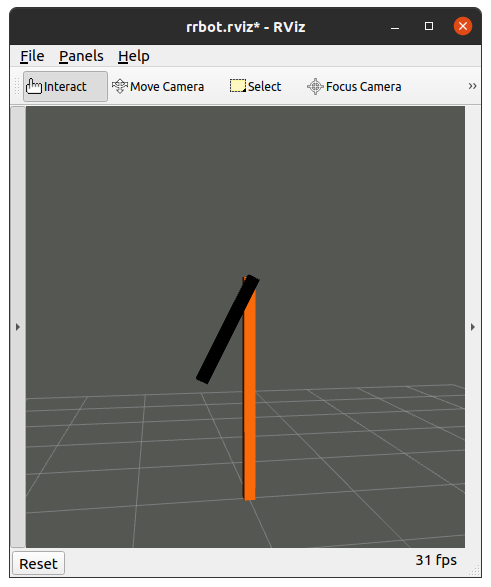

# Gazebo ROS Demos

* Author: Dave Coleman <davetcoleman@gmail.com>
* License: GNU General Public License, version 3 (GPL-3.0)

Forked from [gazebo_ros_demos](https://github.com/ros-simulation/gazebo_ros_demos).
This simulation is meant to be a simplified verson of the original set of packages. The lidar, camera, and link3 are removed and the controller is effort based instead of position based.

## Tutorials

[ROS URDF](http://gazebosim.org/tutorials/?tut=ros_urdf)

## Quick Start

Default Entry:

    roslaunch rrbot_gazebo rrbot_world.launch rviz:=true

Example of Moving Joints:

    rostopic pub /rrbot/joint1_effort_controller/command std_msgs/Float64 "data: -2.0"

## Develop and Contribute

We welcome any contributions to this repo and encourage you to fork the project then send pull requests back to this parent repo. Thanks for your help!
